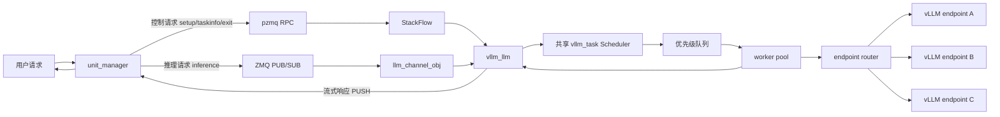

# VllmRoute

面向多 vLLM 后端的 C++ 分布式大模型推理中间件。

本项目不是简单的 HTTP 转发层，而是在多个 vLLM 兼容推理服务前实现一层轻量级调度中间件，用于解决多 GPU / 多模型推理场景中的请求路由、队列排队、流式响应、故障隔离、配置热更新和运行指标观测问题。

## 项目背景

单个 vLLM 服务在高并发推理场景下容易遇到几个问题：

- 不同 GPU / endpoint 的处理能力不同，请求直接打到固定后端会造成负载不均。
- 高并发下排队时间会快速放大，用户侧端到端延迟不稳定。
- 某个 endpoint 故障或变慢时，如果没有健康检查和熔断机制，容易拖慢整体服务。
- 推理请求通常是流式输入、流式输出，中间件需要正确处理分片、转发和结束信号。
- 线上调参和扩缩 endpoint 如果必须重启服务，会影响可用性。

VllmRoute 的目标是在 vLLM 前增加一层可控的 C++ 调度中间件，让多个后端 endpoint 能作为一个统一推理服务对外提供能力。

## 项目实现

- 实现 `unit_manager` 作为统一入口，负责 TCP 接入、请求解析、`work_id` 生命周期管理和消息转发。
- 封装基于 ZeroMQ 的通信层，支持 RPC 调用、消息订阅和结果推送，用于解耦控制面与数据面。
- 设计 `StackFlow` / `llm_channel_obj` 任务通道抽象，统一处理 setup、inference、taskinfo、exit 等任务生命周期。
- 实现共享 `vllm_task` Scheduler，让多个用户 session 共享调度器和 worker pool，减少重复初始化和资源浪费。
- 实现多 endpoint 路由策略，综合队列长度、endpoint 权重、延迟 EWMA、失败惩罚、健康状态和模型 fallback 选择后端。
- 实现优先级队列、队列背压和低优先级拒绝策略，提升高并发场景下的稳定性。
- 支持流式输入拼包和流式输出转发，保证多用户、多分片请求不会互相阻塞。
- 支持 `reload_config` 热更新 endpoint 与 model profile，减少配置变更对进程重启的依赖。
- 增加 `taskinfo`、recent tasks、queue stats、endpoint state、ObservabilityMetrics 等观测能力，方便定位队列等待、后端延迟和失败原因。

## 核心能力

| 方向 | 实现内容 |
|---|---|
| 通信框架 | TCP 入口 + ZeroMQ RPC / PUB-SUB / PUSH-PULL 通道 |
| 生命周期 | `unit_manager` 负责 `work_id` 分配、setup、inference、exit 和 taskinfo |
| 调度模型 | 多用户共享 `vllm_task`，内部维护优先级队列和 worker pool |
| 路由策略 | 基于队列、权重、延迟、失败惩罚和健康状态选择 endpoint |
| 高并发控制 | 队列上限、背压、低优先级丢弃、超时和重试 |
| 可用性 | endpoint 健康检查、熔断、恢复阈值和 fallback |
| 流式处理 | 支持用户流式输入分片组装和 vLLM 流式输出转发 |
| 配置热更新 | 支持运行时更新 endpoint / model profile / 路由参数 |
| 可观测性 | recent tasks、queue stats、endpoint state、请求耗时、TTFT、TPOT 等指标 |

## 架构概览

## 性能结果

在 4 endpoint vLLM 测试环境中，优化后的共享 Scheduler 达到：

- 综合压测 920 请求，稳定 RPS 约 10.2，成功率 100%。
- 高并发 c64 场景下，384 / 384 请求成功。
- P95 backend TTFT 约 119 ms。
- P95 端到端延迟约 6.1 s。
- P95 queue wait 约 5.3 s。
- 吞吐较初始配置提升约 90%。

说明：TTFT 指请求分发到后端后的首 token 延迟；端到端延迟包含中间件排队、后端生成和流式返回时间。
